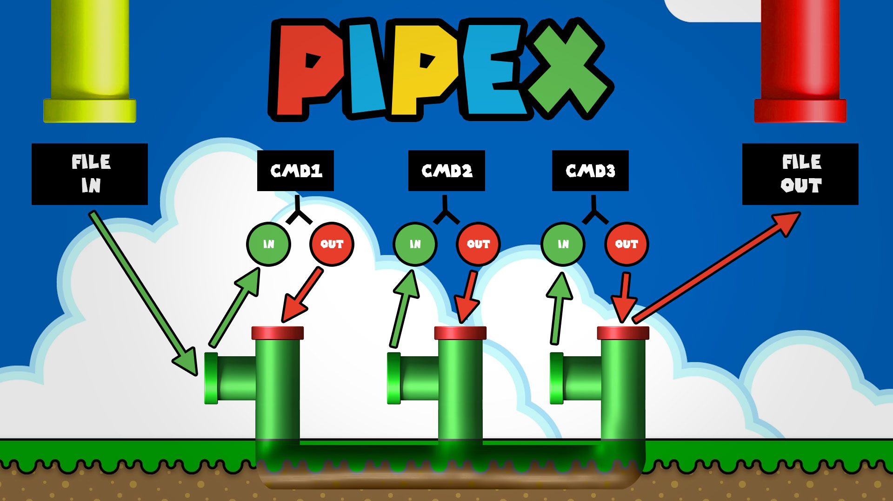

# Pipex_42
---
## Project Overview
---
<mark>**What is a Pipe in Linux?**</mark>


**The Pipe** is a command in Linux that lets you use two or more commands such that output of one command serves as input to the next. In short, the output of each process directly as input to the next one like a pipeline. The symbol ‘|’ denotes a pipe.

Pipes help you mash-up two or more commands at the same time and run them consecutively. You can use powerful commands which can perform complex tasks in a jiffy.

Let us understand this with an example.

When you use ‘cat’ command to view a file which spans multiple pages, the prompt quickly jumps to the last page of the file, and you do not see the content in the middle.

To avoid this, you can pipe the output of the ‘cat’ command to ‘less’ which will show you only one scroll length of content at a time.

```bash
$ cat filename | less 
```
**therefor** 
in this project we choud do the same thing that pipe do.



## Sources
---
**in this project we are allowed to use the following functions:**

* [**access**](http://manpagesfr.free.fr/man/man2/access.2.html)
* [**open**](http://manpagesfr.free.fr/man/man2/open.2.html)
* [**unlink**](http://manpagesfr.free.fr/man/man2/unlink.2.html)
* [**close**](http://manpagesfr.free.fr/man/man2/close.2.html)
* [**read**](http://manpagesfr.free.fr/man/man2/read.2.html)
* [**write**](http://manpagesfr.free.fr/man/man2/write.2.html)
* [**malloc**](http://manpagesfr.free.fr/man/man3/malloc.3.html)
* [**waitpid**](https://linux.die.net/man/3/waitpid)
* [**wait**](http://manpagesfr.free.fr/man/man2/wait.2.html)
* [**free**](http://manpagesfr.free.fr/man/man3/malloc.3.html)
* [**pipe**](http://manpagesfr.free.fr/man/man2/pipe.2.html)
* [**dup**](http://manpagesfr.free.fr/man/man2/dup.2.html)
* [**dup2**](http://manpagesfr.free.fr/man/man2/dup.2.html)
* [**fork**](http://manpagesfr.free.fr/man/man2/fork.2.html)
* [**perror**](http://manpagesfr.free.fr/man/man3/perror.3.html)
* [**strerror**](http://manpagesfr.free.fr/man/man3/strerror.3.html)
* [**exit**](http://manpagesfr.free.fr/man/man3/exit.3.html)

**others sources should help you :**

* [**Unix Processes in C**](https://www.youtube.com/watch?v=PErrlOx3LYE&list=PLfqABt5AS4FkW5mOn2Tn9ZZLLDwA3kZUY&index=22) a good youtube playlist to inderstanding  how processing works in c .
* [**Pipex Cookbook**](https://csnotes.medium.com/pipex-tutorial-42-project-4469f5dd5901)

## Compiling and running
---